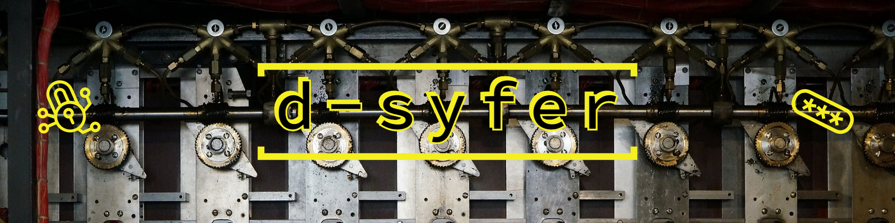

     
  <b>A simple JavaScript project</b>  
  <a href="https://rashil2000.github.io/d-syfer">rashil2000.github.io/d-syfer</a>  

  <b>Contributions:</b>
   Feel free to open any new issues for bugs or feature requests.
   Include screenshots/screengrabs with the pull requests.
   Communicate on the Gitter <a href="https://gitter.im/d-syfer/community">channel</a> if you face any problem.

   Inspiration: <a href="https://www.dcode.fr/">dcode</a>   

